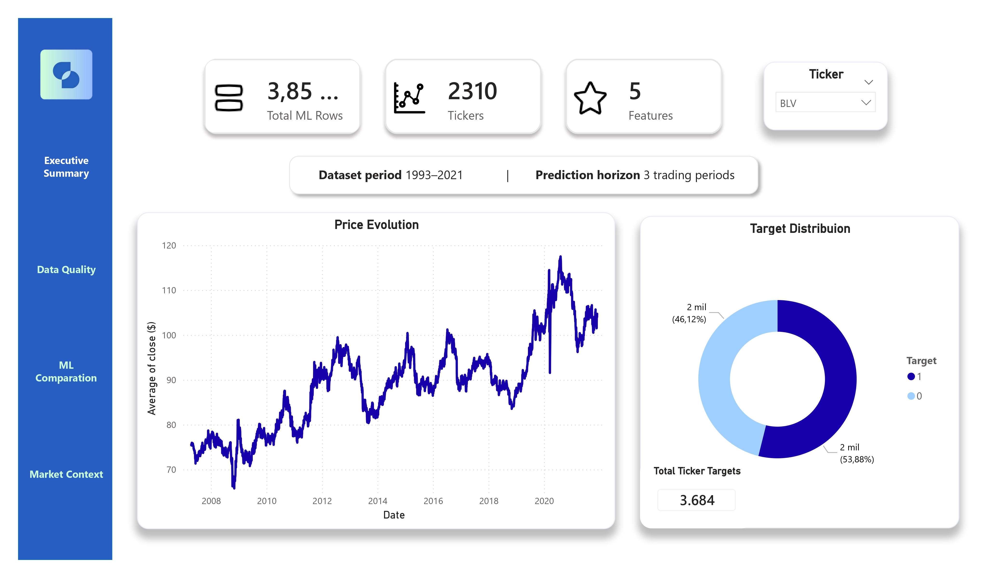
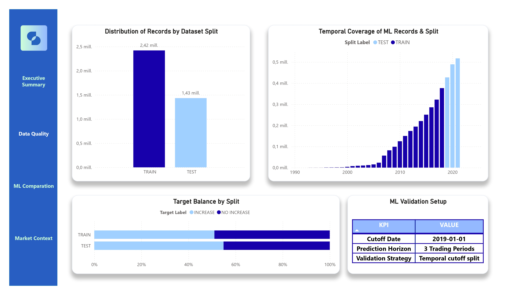
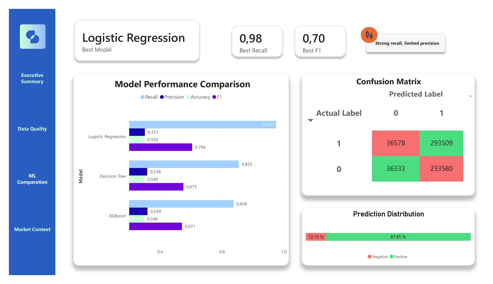
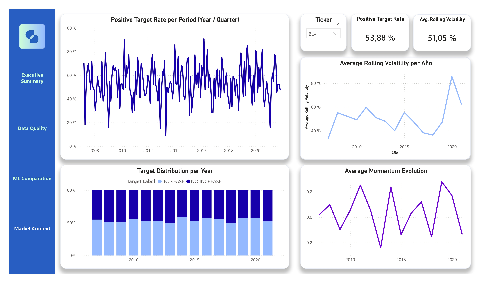

<p align="center">
  
</p>

<h1 align="center" style="margin-top: -60px">STRATA</h1>

<p align="center">
  Data-Driven Financial Forecasting
</p>

<p align="center">
  
  
  
</p>

## Overview

Strata is an end-to-end data pipeline and ML platform for predicting short-term price movements of ETFs using historical market data.

The project covers the full data lifecycle: from raw ingestion and cloud storage to feature engineering, ML model training, and interactive visualization, built on AWS and developed following software engineering best practices.

**Prediction objective:** binary classification of whether an ETF's price will increase over the next 3 trading periods.

## Visualizations

**Executive Summary** — dataset overview, price evolution and target distribution

<p align="center">
  
</p>

**Data Quality** — train/test split distribution, temporal coverage and ML validation setup

<p align="center">
  
</p>

**ML Comparison** — model performance, confusion matrix and prediction distribution

<p align="center">
  
</p>

**Market Context** — rolling volatility, momentum evolution and target distribution per year

<p align="center">
  
</p>

The Power BI dashboard (.pbix) is not included in this repo due to file size.
Screenshots of all views are available in `assets/visualizations/`.

## Architecture

Strata follows a **medallion architecture** on Amazon S3:

```
raw/ → bronze/ → silver/ → gold/
```

| Layer    | Description                                         |
| -------- | --------------------------------------------------- |
| `raw`    | Original CSV data as ingested                       |
| `bronze` | Parsed and validated data                           |
| `silver` | Cleaned, transformed and feature-engineered dataset |
| `gold`   | ML-ready dataset and model evaluation outputs       |

Schema and data lineage managed via **AWS Glue Data Catalog**, queryable through **AWS Athena**.

## Dataset

- **Source:** Historical ETF price data (Kaggle)
- **Coverage:** 1993 to 2021
- **Tickers:** 2,310 ETFs
- **Total ML rows:** ~3.85 million
- **Format:** Parquet (processed layers)

## Feature Engineering

All features computed per ticker using **PySpark window functions** inside a SageMaker notebook:

| Feature           | Description                           |
| ----------------- | ------------------------------------- |
| `rolling_mean_5`  | 5-period rolling mean of close price  |
| `rolling_mean_10` | 10-period rolling mean of close price |
| `rolling_std_5`   | 5-period rolling standard deviation   |
| `momentum_5`      | 5-period price momentum               |
| `price_to_mean_5` | Ratio of close price to 5-period mean |

## ML Models

Three classification models trained and evaluated in SageMaker.
Validation strategy: **temporal cutoff split** (cutoff: 2019-01-01).

| Model               | Recall | Precision | F1    |
| ------------------- | ------ | --------- | ----- |
| Logistic Regression | 0.975  | 0.551     | 0.704 |
| Decision Tree       | 0.855  | 0.558     | 0.675 |
| XGBoost             | 0.838  | 0.559     | 0.671 |

**Best model:** Logistic Regression (Recall: 0.98, F1: 0.70)

## Notebook

The full ML pipeline is documented in:

[`pipeline/stages/strata_model_notebook.ipynb`](pipeline/stages/strata_model_notebook.ipynb)

## Setup

```bash
git clone https://github.com/Tomasmoralessp/strata.git
cd strata
cp .env.example .env
```

Edit `.env` and set your `STRATA_S3_BUCKET` value.

## Authors

<table>
  <tr>
    <td align="center">
      <a href="https://github.com/Tomasmoralessp">
        
      </a>
      <br>
      <b>Tomás Morales Galván</b>
    </td>
    <td align="center">
      <a href="https://github.com/MIGUELBACHILLERGH55">
        
      </a>
      <br>
      <b>Miguel Bachiller Segovia</b>
    </td>
  </tr>
</table>
